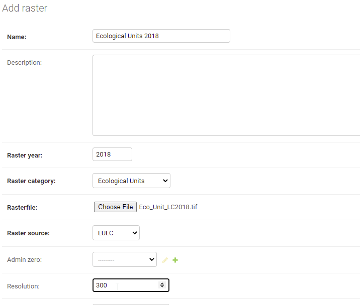

=====================================
Ecological Units Layer
=====================================

QGIS Data pre-processing steps
_________________________________

1. Open the land-cover and soil grids data on qgis

.. figure:: ../_static/Images/ecounit1.png
    :width: 800
    :align: center
    :height: 635
    :alt: opening the data on qgis
    :figclass: align-center

    Loading the Landcover and Soil Grids on Qgis

2. On the processing tool box, search for the *EcologicalUnitsModel* which will appear under **Models**>**Land Productivity Models**

.. figure:: ../_static/Images/ecounit2a.png
    :width: 361
    :align: center
    :height: 279
    :alt: Ecological unit model
    :figclass: align-center

    Finding the Ecological Unit Model

3. On the dialog that pops up, select the Landcover and the soil grid data as the input data and run the model

.. figure:: ../_static/Images/ecounit2.png
    :width: 709
    :align: center
    :height: 580
    :alt: Ecological Unit Model dialog
    :figclass: align-center

    Ecological Unit Model dialog

.. note::
   .. figure:: ../_static/Images/ecounit3.png
    :width: 743
    :align: center
    :height: 242
    :alt: Ecological Unit Model
    :figclass: align-center

    Ecological Unit Model summary

  It is important that the dimenssions of the Landcover data and the soil grids data are matching. This can be checked by right clicking on the layer and navigating to *properties*>*Information*.

  .. figure:: ../_static/Images/ecounit4.png
    :width: 754
    :align: center
    :height: 592
    :alt: Dimensions
    :figclass: align-center

    Checking the dimenssions of the datasets

  To match the dimensions of the two layers you can resample the soil grids to match the resolution of the Landcover data.

4. On runing the model successfully the units layer will be loaded onto Qgis as shown below

.. figure:: ../_static/Images/ecounit3b.png
    :width: 750
    :align: center
    :height: 551
    :alt: Ecological Unit Model dialog
    :figclass: align-center

    Ecological Unit Model output

You can save the output from the Model to your desired location with the appropriate name

.. figure:: ../_static/Images/ecounit5.png
    :width: 732
    :align: center
    :height: 612
    :alt: Ecological Unit Model dialog
    :figclass: align-center

    Saving the output

Uploading the Ecological Units to MISLAND Service
___________________________________________________

    Data Upload Form