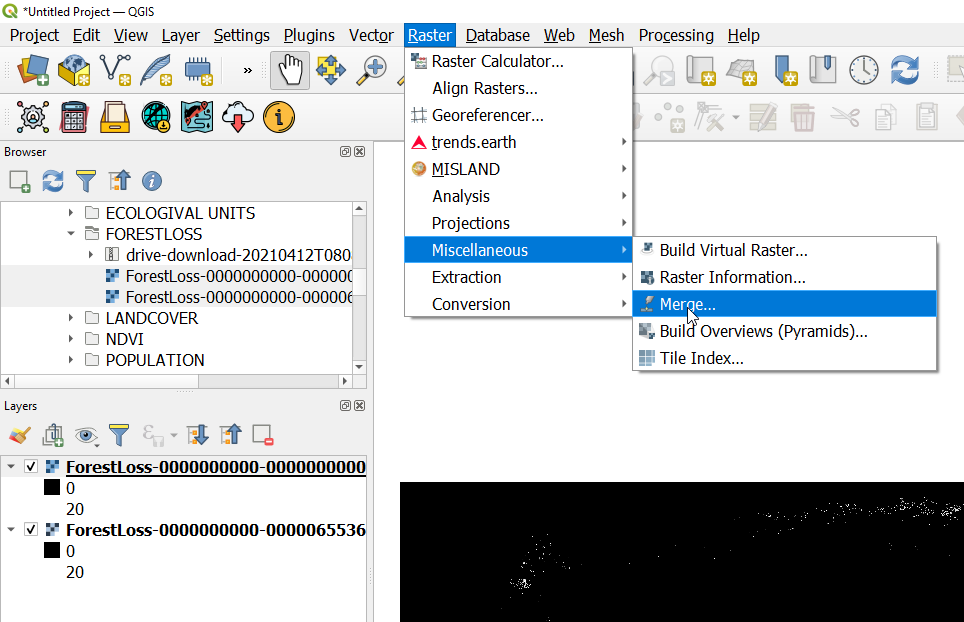

============
Forest Loss 
============
The High-resolution global forset change results from time-series analysis of Landsat images in characterizing global forest extent and change.

The 'first' and 'last' bands are reference multispectral imagery from the first and last available years for Landsat spectral bands 3, 4, 5, and 7. Reference composite imagery represents median observations from a set of quality-assessed growing-season observations for each of these bands.

MISLAND North Africal uses the Hansen Global Forest Change v1.8 to asses forest loss in the North Africa action zone. For more details of the Hansen Global Forest Change see the `user notes`_

.. _user notes: https://storage.googleapis.com/earthenginepartners-hansen/GFC-2020-v1.8/download.html

Data Preprocessing and Download on GEE
________________________________________

1. Open the _`Google Earth Engine Code` and paste the following code to import the **Hansen Global forest change v1.8**, **OSS North Africa Action zone**(study area) and **Geometry** for forest areas in North Africa.

.. code-block:: javascript
   :linenos:

   var image = ee.Image("UMD/hansen/global_forest_change_2020_v1_8"),
    table = ee.FeatureCollection("users/derickongeri/NorthAfrica"),
    geometry = 
    /* color: #d63000 */
    /* shown: false */
    /* displayProperties: [
      {
        "type": "rectangle"
      }
    ] */
    ee.Geometry.Polygon(
        [[[-10.330249200933336, 37.60222178276082],
          [-10.330249200933336, 31.415726509598066],
          [24.562328924066662, 31.415726509598066],
          [24.562328924066662, 37.60222178276082]]], null, false);

2. To select the forestLoss by year band and export the product paste the following code.

.. code-block:: javascript
   :linenos:

   var dataset = image.clip(table);

   var forestLoss = dataset.select('lossyear');

   Map.addLayer(forestLoss);

   Export.image.toDrive({
     image: forestLoss,
     description: 'ForestLoss',
     scale: 30,
     region: geometry,
     maxPixels:  1e13,
     fileFormat: 'GeoTIFF',
     folder:'GEE_classification',
     formatOptions: {
       cloudOptimized: true
     },
       skipEmptyTiles: true
     });

3. Save the code and run it to export the forestloss by year data.

Data Preprocessing in Qgis
____________________________

4. Download the data form Google drive to your desired location on your local machine and load it to Qgis to view the outputs.

.. figure:: ../_static/Images/fr1.png
    :width: 735
    :align: center
    :height: 415
    :alt: Opening the Forestloss data on Qgis
    :figclass: align-center

    Opening the Forestloss year data on Qgis

    Merging the Forestloss year data

.. figure:: ../_static/Images/fr3.png
    :width: 742
    :align: center
    :height: 642
    :alt: Select All layers
    :figclass: align-center

    Selecting All layers to merge

.. figure:: ../_static/Images/fr4.png
    :width: 691
    :align: center
    :height: 608
    :alt: saving the layer
    :figclass: align-center

    Saving the Forest Loss year data

Upload to MISLAND Service
_______________________________

.. figure:: ../_static/Images/fr4.png
    :width: 691
    :align: center
    :height: 608
    :alt: saving the layer
    :figclass: align-center

    Saving the Forest Loss year data

