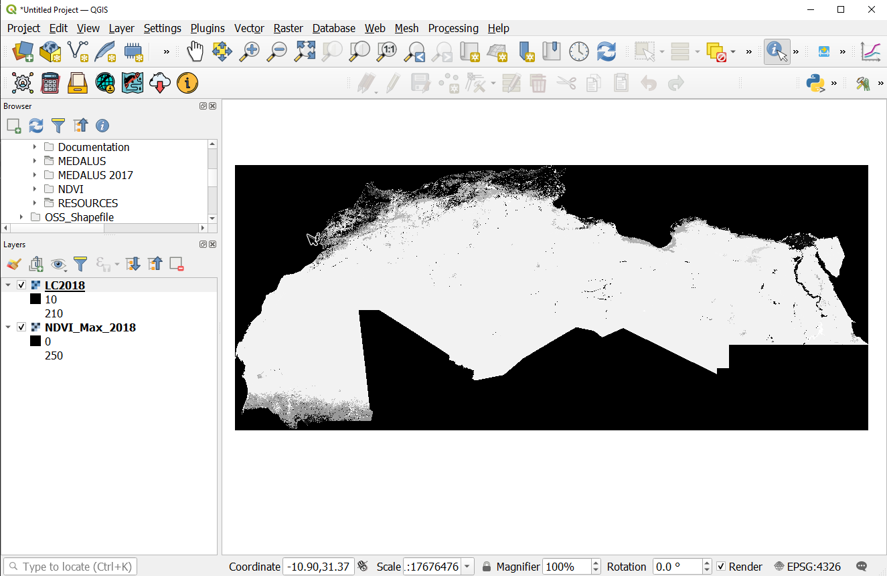
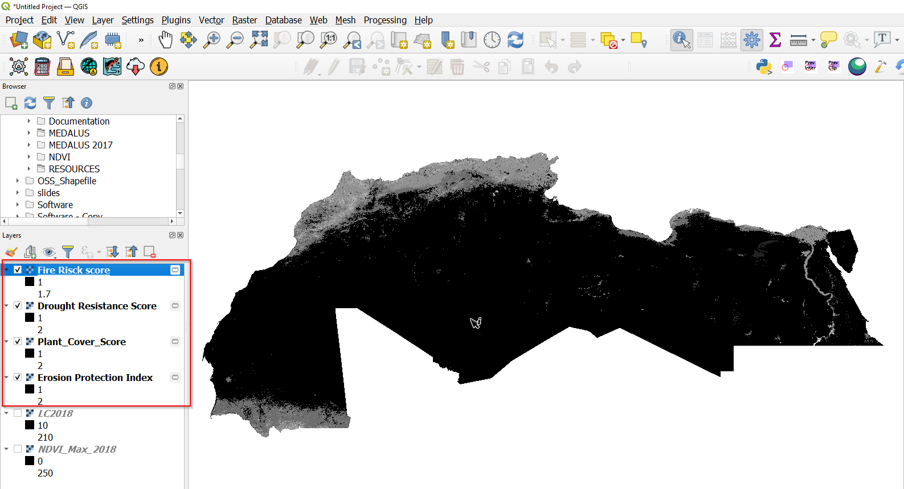

===========================
Vegetation Qulality Index
===========================

Vegetation plays a key role in preventing desertification by providing shelter against wind and water erosion. Plant cover promotes infiltration of water and reduces runoff, residual plant materials from senescent vegetation enriches the soil with organic matter which improves its structure and cohesion . The preliminary classification and the assigned scores of the vegetation characteristics is as summarized in the table below:

+--------------------------+--------------+---------+--------+-----------------+
| Sensor/Dataset           | Temporal     | Spatial | Extent | License         |
+==========================+==============+=========+========+=================+
| `ESA CCI Land Cover`_    | 1992-2018    | 300 m   | Global | `CC by-SA 3.0`_ |
+--------------------------+--------------+---------+--------+-----------------+
| `PROBAV NDVI`_           | 2013-present | 100 m   | Global | `Public Domain` |
+--------------------------+--------------+---------+--------+-----------------+

.. _ESA CCI Land Cover: https://www.esa-landcover-cci.org
.. _CC by-SA 3.0: https://creativecommons.org/licenses/by-sa/3.0/igo

.. _PROBAV NDVI: https://developers.google.com/earth-engine/datasets/catalog/VITO_PROBAV_C1_S1_TOC_100M
.. _Copyright ESA-BELSPO, produced by Vito

Preprocessing in Qgis
----------------------

1. Open the cliped landcover data(all 36 classes) and the ProbaV maximum NDVI composite data on Qgis

    Landcover data and NDVI data loaded to Qgis

2. Once the layers are loaded on to Qgis, open the processing toolbox and search for 'Vegetation Quality Index' in the search bar. The vegetatioon quality index model should show up under the **Models** section as shown. Click on the Model to open it.

.. figure:: ../_static/Images/vqi3a.png
    :width: 334
    :align: center
    :height: 221
    :alt: Opening the VQI model
    :figclass: align-center

    Vegetation Quality Index processing Model

3. On the Vegetation Quality Index dialog that pops up, select the loaded landcover and NDVI data as inputs and run the model

.. figure:: ../_static/Images/vqi4.png
    :width: 800
    :align: center
    :height: 600
    :alt: VQI dialog
    :figclass: align-center

    Vegetation Qulity Index inputs

.. note::
   The vegetation Quality Index model Reclassifies the landcover and assigns scores to the landcover groups for the Fire Risk, Erosion Protection and the Drought resistance. The plant cover is derived from the Maximum NDVI composite as summarized in the graphical model below.

   .. figure:: ../_static/Images/vqi4a.png
    :width: 700
    :align: center
    :height: 400
    :alt: VQI dialog
    :figclass: align-center

    Vegetation Qulity Index inputs

   The scores to the reclassified landcover outputs and plant cover scores are assigned according to the table below: *Ferrara*, *Agostino*, *et al*. "*Updating the MEDALUS‐ESA Framework for Worldwide Land Degradation and Desertification Assessment*." *Land Degradation & Development* 31.12 (2020): 1593-1607.

   .. figure:: ../_static/Images/vqi1.png
    :width: 800
    :align: center
    :height: 600
    :alt: VQI dialog
    :figclass: align-center

    Vegetation Qulity Index inputs

   .. figure:: ../_static/Images/vqi2.png
    :width: 216
    :align: center
    :height: 182
    :alt: VQI dialog
    :figclass: align-center

    Plant cover scores

4. On running the model the ouputs for the elementary VQI variables should be loaded onto QGIS as temporary layers. Save the layers to your desired folder with the appropriate descriptive name.

    Vegetation Qulity Index model outputs

.. note::
   To save the layers with the appropriate dimensions, right click on the layer you want to save and navigate to *Export*>*Save as* and on the *Save as* dialog set the appropriate name and location for the output. Make sure to set the horizontal and vertical resolution option to 0.00277778 for all the outputs as shown below.

.. figure:: ../_static/Images/vqi6.png
    :width: 839
    :align: center
    :height: 657
    :alt: VQI outputs
    :figclass: align-center

    Vegetation Qulity Index model outputs

Data Upload to MISLAND service
-------------------------------
